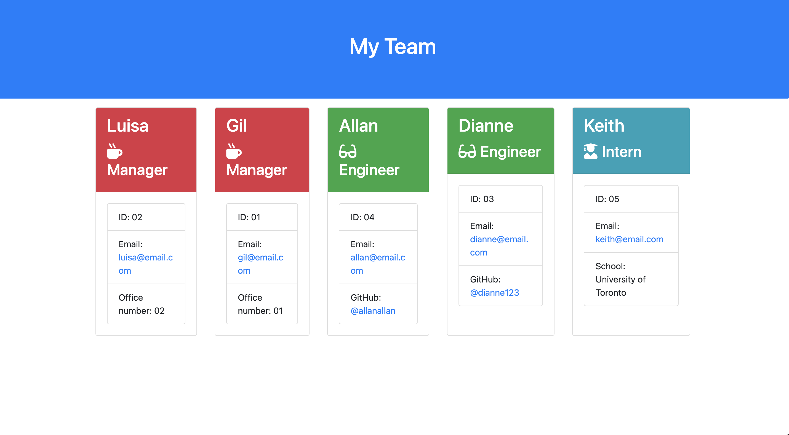

# EmployeeSummary
A team generator application. Using a series of prompts to organize a team and having a full roster displayed on html.

## Object Oriented Programming

This project is based on using the foundations of object oriented programming, accompanied by the familiar face of node.js & the inquirer. 

Users of the Employee Summary will be able to create a visual roster of their team by answering a series of questions. The questions will be asked through the Command line, where the responses will be then translated onto to an html page. 

During the development of this project, a series of jest tests were used to ensure the right outcomes were being produced. 

Checkout the video of it in action 👇

**You can find a link to the video here!** - https://youtu.be/2u8iTsWFC7E

**Here's a screenshot of the generated roster of members:**
